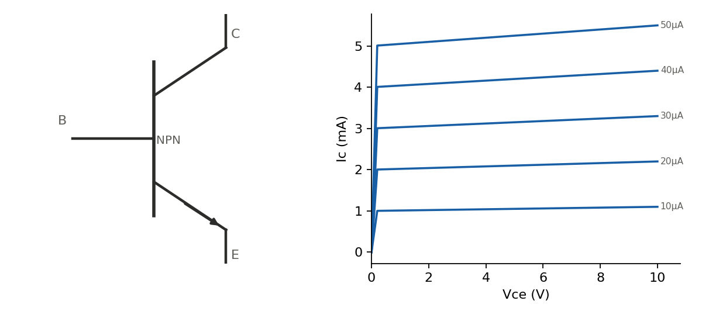

Two back-to-back PN junctions sharing a thin middle layer. A small current into the base controls a much larger current between collector and emitter — the mechanism behind both analog amplification and simple switching.



## NPN vs. PNP

NPN: emitter and collector are N-type, base is a thin P-type layer; current flows collector-to-emitter, conventional base current flows in. PNP is the mirror image — emitter/collector P-type, base N-type, currents reversed. NPN is more common in modern designs since electrons (the majority carrier doing the work in an NPN) have higher mobility than holes, giving better high-frequency performance for a given geometry.

## Current relationships

$$
I_C = \beta I_B, \qquad I_E = I_C + I_B
$$

$\beta$ (also written $h_{FE}$) is typically 100–300 for small-signal parts, but varies significantly with temperature, collector current, and from device to device even within the same part number — never design something that depends on a precise $\beta$ value.

## Operating regions

- **Cutoff**: $V_{BE}$ below ~0.6 V, no base current, transistor is off.
- **Active**: base-emitter junction forward biased, base-collector junction reverse biased. $I_C \approx \beta I_B$, roughly independent of $V_{CE}$ (the slight upward slope in the figure is the Early effect). This is the amplifier region.
- **Saturation**: both junctions forward biased, $V_{CE}$ drops to a small value (~0.1–0.3 V), $I_C$ is limited by the external circuit rather than $\beta I_B$. This is the "fully on" switch region.

## Calculator: voltage-divider bias point

The standard way to bias an NPN in the active region: a resistor divider sets a stable base voltage, an emitter resistor stabilizes the operating point against $\beta$ variation.

$$
V_B = V_{CC}\frac{R_2}{R_1+R_2}, \qquad I_E \approx \frac{V_B - 0.7}{R_E}, \qquad V_{CE} = V_{CC} - I_C(R_C+R_E)
$$

```{=html}
<div id="bjt-bias-calc"></div>
<script src="../assets/js/calc-engine.js"></script>
<script>
Calc.create({
  root: "bjt-bias-calc",
  inputs: [
    { id: "Vcc", label: "Vcc (V)", value: 12, min: 0, step: 0.1 },
    { id: "R1", label: "R1 (kΩ)", value: 22, min: 0.01, step: 1 },
    { id: "R2", label: "R2 (kΩ)", value: 4.7, min: 0.01, step: 0.1 },
    { id: "Rc", label: "Rc (kΩ)", value: 2.2, min: 0, step: 0.1 },
    { id: "Re", label: "Re (kΩ)", value: 1, min: 0.01, step: 0.1 }
  ],
  outputs: [
    { id: "Vb", label: "VB" },
    { id: "Ie", label: "IE" },
    { id: "Vce", label: "VCE" }
  ],
  compute: function (v) {
    if (v.R1 + v.R2 <= 0 || v.Re <= 0) return { Vb: "-", Ie: "-", Vce: "-" };
    var Vb = v.Vcc * (v.R2 / (v.R1 + v.R2));
    var Ie_mA = (Vb - 0.7) / v.Re;
    if (Ie_mA < 0) return { Vb: Vb.toFixed(2) + " V", Ie: "cutoff", Vce: "-" };
    var Vce = v.Vcc - Ie_mA * (v.Rc + v.Re);
    return {
      Vb: Vb.toFixed(2) + " V",
      Ie: Ie_mA.toFixed(2) + " mA",
      Vce: Vce.toFixed(2) + " V"
    };
  }
});
</script>
```

If $V_{CE}$ comes out near 0 or negative, the resistor values are driving the transistor into saturation rather than the active region — reduce $R_C$/$R_E$ or the base voltage.

## As a switch

Used as a switch, the goal is deliberately deep saturation rather than a well-controlled active-region current. Choosing enough base current to guarantee saturation across the worst-case (minimum) $\beta$, with margin — a "forced $\beta$" of 10 rather than the datasheet's typical 100–300 is a common conservative choice:

$$
I_{B} = \frac{I_{C}}{\beta_{forced}}, \qquad R_B = \frac{V_{in} - 0.7}{I_B}
$$
