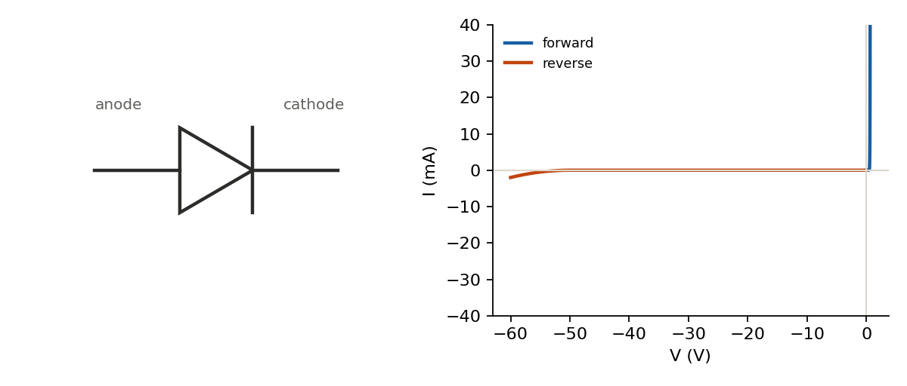

## The PN junction

A diode is a single junction between P-type material (doped with acceptor atoms, majority carriers are holes) and N-type material (doped with donor atoms, majority carriers are electrons). Where they meet, carriers diffuse across and recombine, leaving behind a region stripped of free carriers — the depletion region — with a built-in electric field opposing further diffusion.

Forward bias (P side positive relative to N) narrows the depletion region and, past a threshold, lets current flow easily. Reverse bias widens it and current stays near zero — until reverse breakdown.



## The diode equation

$$
I = I_S \left( e^{V / (nV_T)} - 1 \right)
$$

$I_S$ is the reverse saturation current (tiny, often pA–nA), $n$ is the ideality factor (close to 1 for a good diode), and $V_T = kT/q \approx 25.85\,\text{mV}$ at room temperature. The exponential is why forward voltage looks almost like a fixed ~0.6–0.7 V (silicon) rather than a smooth ramp — current changes by roughly 10× for every ~60 mV of forward voltage.

Forward voltage drops slightly with temperature, about $-2\,\text{mV/°C}$ for silicon — worth remembering when a design runs hot.

## Rectification

A single diode passes only one half of an AC waveform (half-wave rectification). Four diodes in a bridge pass both halves in the same direction (full-wave), roughly doubling the ripple frequency seen by the output filter capacitor and halving the required capacitance for the same ripple — the same $C = \Delta I / (f \cdot \Delta V)$ relationship as the buck converter's output cap, just driven by load current instead of inductor ripple current.

## Calculator: series resistor for a diode or LED

The most common practical use of the diode equation: given a supply and a target forward current, size the series resistor. Treats the diode's forward drop as roughly constant, which is accurate enough for design work once $V_f$ is known from a datasheet.

$$
R = \frac{V_{supply} - V_f}{I_f}
$$

```{=html}
<div id="diode-r-calc"></div>
<script src="../assets/js/calc-engine.js"></script>
<script>
Calc.create({
  root: "diode-r-calc",
  inputs: [
    { id: "Vs", label: "Supply (V)", value: 5, min: 0, step: 0.1 },
    { id: "Vf", label: "Diode Vf (V)", value: 2, min: 0, step: 0.05 },
    { id: "If", label: "Target If (mA)", value: 20, min: 0.01, step: 1 }
  ],
  outputs: [
    { id: "R", label: "Series R" },
    { id: "P", label: "Resistor power" }
  ],
  compute: function (v) {
    var drop = v.Vs - v.Vf;
    if (drop <= 0 || v.If <= 0) return { R: "invalid", P: "-" };
    var I = v.If / 1000;
    var R = drop / I;
    var P = drop * I;
    return {
      R: R.toFixed(1) + " Ω",
      P: (P * 1000).toFixed(1) + " mW"
    };
  }
});
</script>
```
