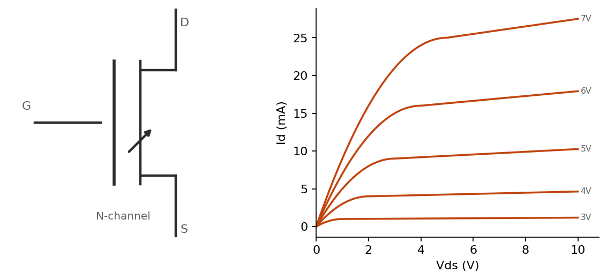

A voltage on an insulated gate creates (or removes) a conductive channel between source and drain — no gate current flows in steady state, which is the main practical difference from a BJT's current-controlled base.



## Enhancement vs. depletion, N vs. P channel

Enhancement-mode devices (the vast majority in use today) are off at $V_{GS}=0$ and need gate voltage past a threshold to turn on — safer as a default state, which is why they dominate. Depletion-mode devices are on at $V_{GS}=0$ and need gate voltage to turn off. N-channel conducts with electrons and needs positive $V_{GS}$; P-channel conducts with holes and needs negative $V_{GS}$. N-channel is preferred where possible — electron mobility gives lower on-resistance for the same die area.

## Regions of operation

Let $V_{ov} = V_{GS} - V_{th}$ (the "overdrive" voltage). Using the simple square-law model:

- **Cutoff**: $V_{GS} < V_{th}$, no channel, $I_D = 0$.
- **Triode / linear**: $V_{DS} < V_{ov}$, behaves like a voltage-controlled resistor: $I_D = k\left(V_{ov}V_{DS} - \frac{V_{DS}^2}{2}\right)$
- **Saturation**: $V_{DS} \geq V_{ov}$, current roughly flat (ideally independent of $V_{DS}$): $I_D \approx \frac{k}{2}V_{ov}^2$

Power MOSFETs are almost always operated either fully in triode (as a low-resistance switch) or fully off — the region in between is where switching loss happens, and a well-designed switching circuit spends as little time there as possible.

## On-resistance and conduction loss

For a MOSFET used as a switch, the datasheet parameter that matters most is $R_{DS(on)}$ — resistance while fully on. Conduction power loss follows directly:

$$
P_{cond} = I_{RMS}^2 \cdot R_{DS(on)}
$$

$R_{DS(on)}$ rises with temperature (typically 30–50% higher at 125°C than at 25°C) and with gate drive that's lower than the datasheet test condition — both worth checking against the datasheet curves, not just the headline number.

## Calculator: conduction loss

```{=html}
<div id="mosfet-loss-calc"></div>
<script src="../assets/js/calc-engine.js"></script>
<script>
Calc.create({
  root: "mosfet-loss-calc",
  inputs: [
    { id: "Rds", label: "Rds(on) (mΩ)", value: 20, min: 0.001, step: 1 },
    { id: "Irms", label: "Irms (A)", value: 3, min: 0, step: 0.1 }
  ],
  outputs: [
    { id: "P", label: "Conduction loss" }
  ],
  compute: function (v) {
    var R = v.Rds / 1000;
    var P = v.Irms * v.Irms * R;
    return { P: (P * 1000).toFixed(1) + " mW" };
  }
});
</script>
```

Switching loss — the energy lost transitioning through the linear region on every turn-on/turn-off — depends on gate charge $Q_g$, drive strength, and switching frequency, and generally dominates conduction loss at higher frequencies. Worth its own page once it's next in the queue.
