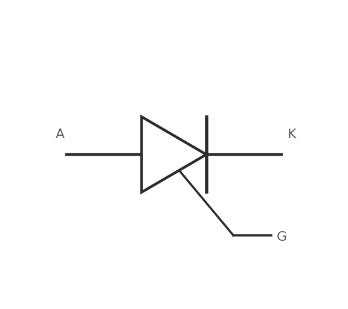

A thyristor is a four-layer PNPN device that behaves like nothing else on this page: it latches. A gate pulse triggers it into conduction, and it then stays conducting — no continued gate drive needed — until the main current drops below a minimum holding current $I_H$, at which point it turns off on its own.



## Silicon-controlled rectifier (SCR)

The basic thyristor: conducts in one direction only, like a diode, but stays off even when forward biased until the gate receives a trigger pulse. Once triggered and above $I_H$, the gate loses all further control — the only way to turn it off is to bring the main current below $I_H$, which in an AC circuit happens automatically every half-cycle as the waveform crosses zero.

That zero-crossing turn-off is exactly what makes SCRs useful for phase-controlled AC power delivery: triggering the gate at a chosen delay (firing angle $\alpha$) after each zero crossing controls how much of each half-cycle actually reaches the load, and the device turns itself off cleanly at the next crossing regardless.

### Phase control and RMS output

For a resistive load, delaying the firing angle $\alpha$ (0 to $\pi$ radians within each half-cycle) reduces the RMS voltage delivered to the load:

$$
V_{RMS} = V_{in,RMS}\sqrt{1 - \frac{\alpha}{\pi} + \frac{\sin(2\alpha)}{2\pi}}
$$

$\alpha = 0$ delivers the full waveform; $\alpha = \pi$ delivers none. This is the mechanism behind old-style incandescent light dimmers.

```{=html}
<div id="scr-phase-calc"></div>
<script src="../assets/js/calc-engine.js"></script>
<script>
Calc.create({
  root: "scr-phase-calc",
  inputs: [
    { id: "Vrms", label: "Vin RMS (V)", value: 230, min: 0, step: 1 },
    { id: "alphaDeg", label: "Firing angle α (deg)", value: 90, min: 0, step: 1 }
  ],
  outputs: [
    { id: "Vout", label: "Output Vrms" }
  ],
  compute: function (v) {
    var alpha = v.alphaDeg * Math.PI / 180;
    if (alpha < 0 || alpha > Math.PI) return { Vout: "0–180° only" };
    var factor = Math.sqrt(Math.max(0, 1 - alpha / Math.PI + Math.sin(2 * alpha) / (2 * Math.PI)));
    return { Vout: (v.Vrms * factor).toFixed(1) + " V" };
  }
});
</script>
```

## TRIAC

An SCR only conducts one direction, so it only controls one half of an AC waveform. A TRIAC is functionally two SCRs wired anti-parallel in a single package, controllable from a single gate — it conducts (and can be triggered) on both half-cycles, which is why it's the part actually found in most household dimmers and AC motor speed controls rather than a pair of discrete SCRs.

## A caution worth stating plainly

Thyristor circuits usually work directly with mains voltage. That combination of high voltage and latching behavior (a triggered device won't turn off just because the gate signal goes away) is genuinely dangerous to prototype casually — isolation, proper fusing, and mains-rated components matter here more than almost anywhere else on this site.
