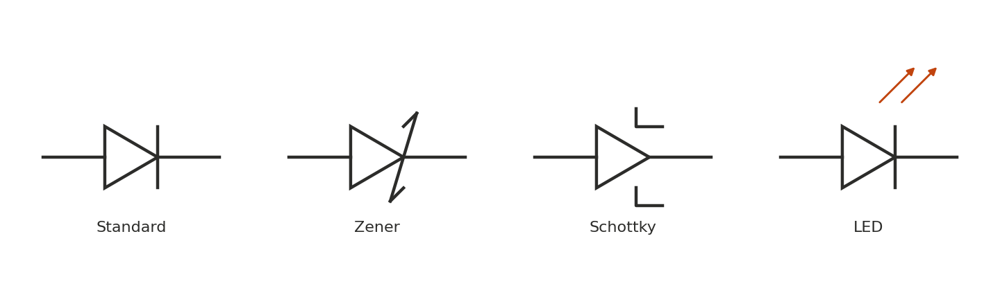

Two diode variants built around a normal PN junction's least-wanted properties — breakdown and switching delay — turned into features.



## Zener diodes

A standard diode's reverse breakdown is destructive if the current isn't limited — but a Zener is doped specifically to break down at a well-controlled voltage $V_Z$ and survive it indefinitely, provided power dissipation stays within its rating. That gives a cheap, if imprecise (a few percent, and temperature-sensitive), voltage reference.

### Basic shunt regulator

A series resistor from the supply into the Zener (with the load in parallel) sets the Zener current; the resistor must be sized so the Zener always sees at least its minimum regulation current, across the full load current range:

$$
R = \frac{V_{in} - V_Z}{I_Z + I_{load}}
$$

Simple and lossy — the series resistor burns power continuously, and regulation is only as good as the Zener's own impedance. Fine for a low-current reference or bias supply, not for anything power-hungry (a linear or switching regulator does the same job far more efficiently).

### Calculator

```{=html}
<div id="zener-calc"></div>
<script src="../assets/js/calc-engine.js"></script>
<script>
Calc.create({
  root: "zener-calc",
  inputs: [
    { id: "Vin", label: "Vin (V)", value: 12, min: 0, step: 0.1 },
    { id: "Vz", label: "Vz (V)", value: 5.1, min: 0, step: 0.1 },
    { id: "Iz", label: "Zener current (mA)", value: 10, min: 0.01, step: 1 },
    { id: "Iload", label: "Load current (mA)", value: 5, min: 0, step: 1 }
  ],
  outputs: [
    { id: "R", label: "Series R" },
    { id: "P", label: "Zener power" }
  ],
  compute: function (v) {
    var drop = v.Vin - v.Vz;
    var Itotal = (v.Iz + v.Iload) / 1000;
    if (drop <= 0 || Itotal <= 0) return { R: "invalid", P: "-" };
    var R = drop / Itotal;
    var Pz = v.Vz * (v.Iz / 1000);
    return {
      R: R.toFixed(1) + " Ω",
      P: (Pz * 1000).toFixed(1) + " mW"
    };
  }
});
</script>
```

## Schottky diodes

A Schottky diode replaces the PN junction with a metal-semiconductor junction. Two practical consequences follow directly from that:

Lower forward voltage — typically 0.2–0.4 V versus 0.6–0.7 V for silicon PN — because there's no minority-carrier injection barrier to overcome in the same way.

No reverse-recovery time — a PN diode stores minority charge while conducting and takes tens to hundreds of nanoseconds to stop conducting when reverse-biased; a Schottky is a majority-carrier device with essentially none of that, so it switches off almost instantly.

That combination is exactly why Schottkys show up as the freewheeling/catch diode in unsynchronized buck converters and as reverse-polarity protection where the forward drop matters. The trade-offs: higher reverse leakage current (worse with temperature) and generally lower reverse voltage ratings than comparable PN diodes.
