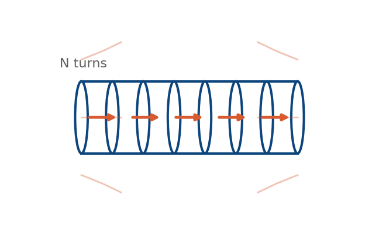
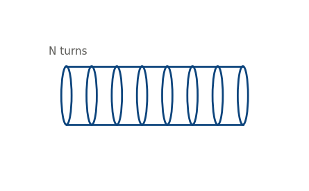

A quick derivation of solenoid inductance from first principles, then the practical correction engineers actually use, with a calculator to try real turn counts and dimensions.

## The ideal case

Treating the coil as infinitely long, Ampere's law gives a uniform field inside: $B = \mu_0 n I$, where $n = N / l$ is turns per unit length. Flux linkage through all $N$ turns gives:

$$
L_{ideal} = \mu_0 N^2 \frac{\pi r^2}{l}
$$

This overestimates inductance for any real, finite coil — it ignores fringing at the ends.



## Wheeler's correction

For a real single-layer coil where length isn't much greater than radius, Wheeler's 1928 approximation is the standard practical formula ($r$, $l$ in inches, result in $\mu H$):

$$
L_{\mu H} \approx \frac{r^2 N^2}{9r + 10l}
$$

Valid roughly for $l > 0.4r$. Below that, it undercorrects and a full Nagaoka-coefficient treatment is needed.



## Calculator

```{=html}
<div class="calc">
  <div class="row">
    <div>
      <label>Turns N</label>
      <input type="number" id="turns" value="50" min="1" step="1">
    </div>
    <div>
      <label>Radius r (cm)</label>
      <input type="number" id="radius" value="1.5" min="0.1" step="0.1">
    </div>
    <div>
      <label>Length l (cm)</label>
      <input type="number" id="length" value="4" min="0.1" step="0.1">
    </div>
  </div>
  <div class="out-row">
    <div class="out"><div class="num" id="out-ideal">-</div><div class="lbl">Ideal L</div></div>
    <div class="out"><div class="num" id="out-wheeler">-</div><div class="lbl">Wheeler L</div></div>
    <div class="out"><div class="num" id="out-ratio">-</div><div class="lbl">Ideal / Wheeler</div></div>
  </div>
</div>
<script>
(function() {
  const turnsEl = document.getElementById("turns");
  const radiusEl = document.getElementById("radius");
  const lengthEl = document.getElementById("length");
  const outIdeal = document.getElementById("out-ideal");
  const outWheeler = document.getElementById("out-wheeler");
  const outRatio = document.getElementById("out-ratio");
  const MU0 = 4 * Math.PI * 1e-7;

  function compute() {
    const N = parseFloat(turnsEl.value) || 0;
    const rCm = parseFloat(radiusEl.value) || 0;
    const lCm = parseFloat(lengthEl.value) || 0;
    const rM = rCm / 100, lM = lCm / 100;
    const A = Math.PI * rM * rM;
    const lIdealUH = (lM > 0 ? (MU0 * N * N * A) / lM : 0) * 1e6;
    const rIn = rCm / 2.54, lIn = lCm / 2.54;
    const denom = 9 * rIn + 10 * lIn;
    const lWheelerUH = denom > 0 ? (rIn * rIn * N * N) / denom : 0;
    outIdeal.textContent = lIdealUH.toFixed(2) + " uH";
    outWheeler.textContent = lWheelerUH.toFixed(2) + " uH";
    outRatio.textContent = lWheelerUH > 0 ? (lIdealUH / lWheelerUH).toFixed(2) + "x" : "-";
  }
  [turnsEl, radiusEl, lengthEl].forEach(el => el.addEventListener("input", compute));
  compute();
})();
</script>
```
